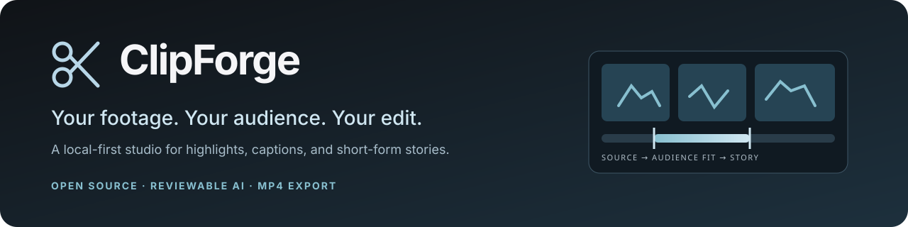
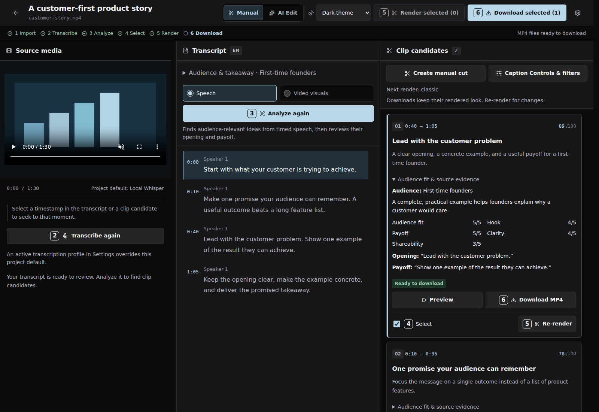
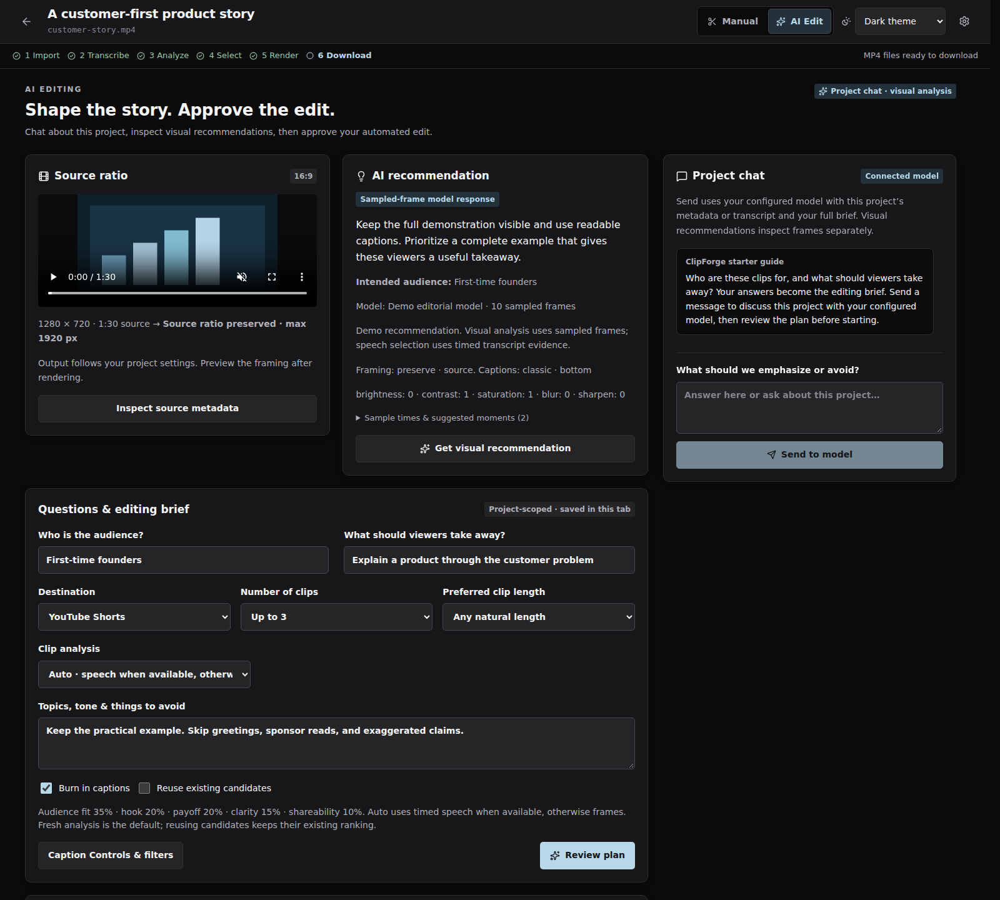
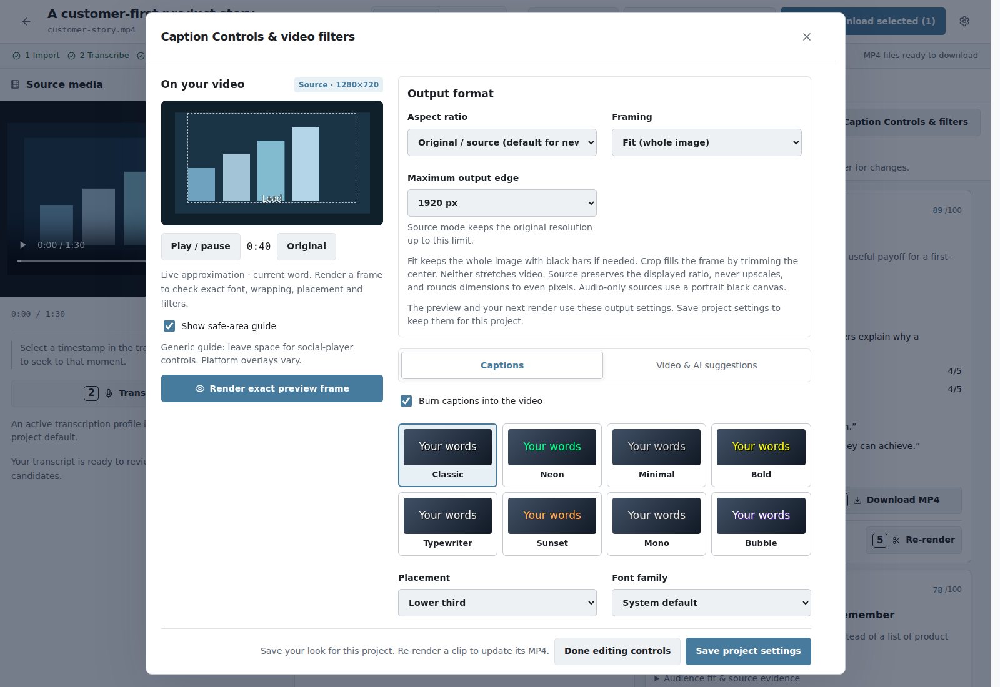
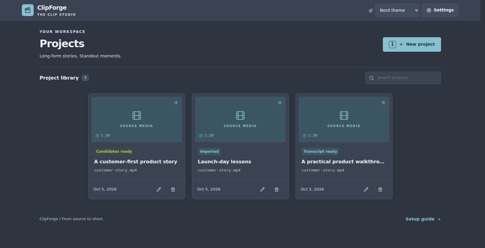
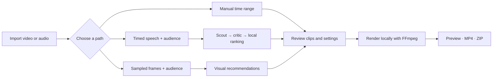

# ClipForge

<p align="center">
  
</p>

<p align="center">
  <strong>Turn long recordings into short, audience-relevant stories.</strong><br />
  Import. Find the idea. Shape the edit. Render on your own machine.
</p>

<p align="center">
  <a href="https://github.com/Adnr7/clipforge/actions/workflows/ci.yml"></a>
  <a href="LICENSE"></a>
  <a href="docs/development.md"></a>
  <a href="frontend/package.json"></a>
</p>

<p align="center">
  <a href="#getting-started">Get started</a> ·
  <a href="#see-the-studio">See the studio</a> ·
  <a href="#how-it-works">Workflow</a> ·
  <a href="docs/README.md">Documentation</a> ·
  <a href="CONTRIBUTING.md">Contribute</a>
</p>

---

ClipForge is a **local-first video and audio clipping studio** for desktop or
browser. Make a manual cut, or give your configured model an audience and a
takeaway. Review the source evidence, choose framing and captions, and export
H.264 MP4s or a ZIP of completed clips.

**No ClipForge account or subscription.** Manual editing needs no API key.
Cloud providers may charge for usage; local AI needs installed models and
appropriate hardware. The app is an early-stage **source distribution**;
browser mode is the easiest starting point.

## See the studio

### Source, transcript, and evidence — together



<table>
  <tr>
    <td width="50%"><strong>Shape the story in AI Edit</strong><br /></td>
    <td width="50%"><strong>Style the output in Light</strong><br /></td>
  </tr>
</table>

<details>
<summary><strong>Explore the project library in Nord</strong></summary>



</details>

<sub>Screenshots show the actual React interface with generated media and synthetic
project/model responses. [Reproduce the screenshots](docs/testing.md#documentation-screenshots).</sub>

## What you can do

| Capability | In the studio |
| --- | --- |
| **Bring your recordings** | Local video/audio upload, external source path, or a single YouTube video via yt-dlp |
| **Cut without AI** | Create and render exact manual time ranges, including silent video |
| **Find spoken ideas** | Deepgram or local Whisper → timed evidence → audience-aware scout and critic |
| **Inspect visual moments** | Bounded timestamped stills with an image-capable model; no transcript required |
| **Guide an edit** | Project chat, shared audience/goal, visual advice, and reviewed automation |
| **Preserve or reframe** | Source, 16:9, 9:16, 1:1, 4:5, 4:3, 3:2; fit or center-crop |
| **Make it readable** | Eight caption presets; font, outline, shadow, background, placement, and word grouping |
| **Adjust the look** | Brightness, contrast, saturation, blur, sharpening, and exact rendered-frame previews |
| **Export locally** | H.264 MP4, original source audio when available, and branded ZIP filenames |
| **Use your connection** | Saved provider profiles, custom models/endpoints, and Dark / Light / Nord themes |

### Choose your editing path

| | Manual | Speech analysis | Visual analysis |
| --- | --- | --- | --- |
| Best for | A time range you already know | Interviews, talks, tutorials, podcasts | Demos, silent footage, music videos |
| Needs transcription | No; only for captions | Yes, with real timestamps | No; speech context is optional |
| Needs a model | No | Text-capable | Image-capable |
| Boundary basis | Your start/end values | Supplied transcript units and quotes | Approximate intervals backed by sampled frames |
| Review | Framing and final export | Relevance, opening, payoff, timing | Visible evidence, framing, timing |

## How it works



### Audience first, source grounded

Tell ClipForge **who should care** and **what they should take away**. The shared
audience brief reaches Manual analysis, AI Edit, project chat, and editing-look
suggestions. Changing fields alone does not call a model.

For speech selection, the model scouts timestamped transcript units, then a
separate critic call reviews the shortlisted text. Code resolves timestamps,
validates opening/closing quotes, computes scores, and removes overlaps and
duplicate topic labels. It returns fewer clips when ideas do not meet the gate.

| Editorial dimension | Weight | Question |
| --- | ---: | --- |
| **Audience fit** | **35%** | Does this specific viewer have a reason to care? |
| Hook | 20% | Does the actual opening earn attention? |
| Payoff | 20% | Does the clip deliver its promise? |
| Standalone clarity | 15% | Does it make sense without missing context? |
| Shareability | 10% | Why might this viewer save or share it? |

Each dimension is scored 0–5; audience fit, payoff, and clarity must each reach
3. The displayed 0–100 score is an **editorial heuristic**, not a prediction of
views or retention. The critic uses the same selected model in a separate call.
Visual analysis has its own single-pass sampled-frame contract.
[Read the method, limits, and evaluation guide →](docs/audience-selection.md)

## Getting started

### Prerequisites

| Dependency | Requirement | Used for |
| --- | --- | --- |
| Python | **3.10+** | Backend and desktop launcher |
| Node.js | **22.12+** | Building the interface and browser tests |
| FFmpeg + FFprobe | On `PATH`, with `libx264`, `drawtext`, and usable fonts | Probe, previews, captions, and export |
| Native WebView | Optional, platform-specific | Desktop window; browser mode does not need it |

```bash
git clone https://github.com/Adnr7/clipforge.git
cd clipforge
```

<details>
<summary><strong>Install FFmpeg</strong></summary>

```bash
# Ubuntu / Debian
sudo apt install ffmpeg fonts-dejavu-core python3-venv

# macOS with Homebrew
brew install ffmpeg
```

On Windows, install an FFmpeg build containing FFprobe, add its `bin` directory
to `PATH`, and open a new terminal. Verify both `ffmpeg -version` and
`ffprobe -version`.

</details>

### 1 · Install the backend

**macOS / Linux**

```bash
python3 -m venv .venv
source .venv/bin/activate
python -m pip install -r requirements.txt
```

**Windows PowerShell**

```powershell
py -3 -m venv .venv
.\.venv\Scripts\Activate.ps1
python -m pip install -r requirements.txt
```

### 2 · Build the interface

```bash
npm --prefix frontend ci
npm --prefix frontend run build
```

### 3 · Open the studio

```bash
python main.py --web
```

Open **http://127.0.0.1:5174**. For the native window, use `python main.py` and
follow [pywebview's platform installation guide](https://pywebview.flowrl.com/guide/installation.html).

### 4 · Add AI when you need it

Open **Settings → Providers**, save a connection, and activate it.

| Task | What to configure |
| --- | --- |
| Manual cuts / captionless rendering | Nothing — no AI key needed |
| Cloud transcription | Deepgram API key |
| Local transcription | `python -m pip install -r requirements-whisper.txt`, then a Whisper profile |
| Speech selection / project chat | DeepSeek, Claude, Gemini, OpenAI, OpenRouter, Groq, Ollama, or custom OpenAI-compatible model |
| Visual selection / recommendations | An image-capable model on a supported connection |

Whisper downloads its selected model on first use. Ollama runs as a separate
service. A provider can offer both text-only and vision models; choose the
actual capability you need. [Provider setup and transport details](docs/development.md#provider-connections).

## Make your first clip

### Without AI

1. Create a project and import media.
2. Choose **Create manual cut**, set start/end times, and save.
3. Open **Caption Controls & filters**; choose framing and the look. Keep captions
   off when no speech transcript exists.
4. Select the clip and choose **Render selected**.
5. Preview the completed artifact, then download its MP4 or the selected-clips ZIP.

### With an audience brief

1. Set **Audience & takeaway** in Manual, or the shared fields in **AI Edit**.
2. Transcribe for speech selection, or choose **Video visuals** with a vision model.
3. Run analysis; review boundaries, audience benefit, rubric, and source evidence.
4. Choose the clips and settings, render, and inspect the result.

AI Edit defaults to **Auto** — speech when available, otherwise sampled frames —
and **fresh analysis** for the current audience. Review the plan before starting.
**Use AI recommended settings** is opt-in; reusing existing candidates does not
rerank them for a new audience. [Detailed AI Edit behavior](docs/ai-edit-mode.md).

New projects preserve source framing without upscaling. **Fit** keeps the whole
image and may add bars; **center-crop** trims edges. Neither stretches footage.
Audio-only clips use a black video canvas. Completed MP4s retain their rendered
look; changing controls requires a new render.

## Local data and processing

| Setting | Default | Purpose |
| --- | --- | --- |
| `DATA_DIR` | `~/.clipforge` | SQLite database, saved settings/profiles, managed media and renders |
| `CLIPFORGE_PORT` | `5174` | Local backend and built interface |

API keys can be saved in Settings; a root `.env` is optional.
[`.env.example`](.env.example) documents defaults. Saved `DATA_DIR/.env` values
take precedence over root `.env` at startup. Set `DATA_DIR` before launching to
use another storage location.

| Feature | Processing / provider payload |
| --- | --- |
| Manual cuts, previews, renders, ZIPs | Local files and FFmpeg |
| Deepgram transcription | Extracted audio sent to Deepgram |
| Cloud speech selection | Timed transcript windows, shortlisted clip text, and editing brief |
| Cloud project chat | Allowlisted technical metadata, optional transcript, brief and history |
| Cloud visual analysis | Bounded timestamped JPEGs and optional text context; no audio |
| Local Whisper / local Ollama | Local inference after installing models |

The app has no application telemetry and binds to localhost. Credentials are
stored locally, **not encrypted at rest**, and are write-only through the API.
YouTube import contacts YouTube through yt-dlp.
[Data architecture](docs/architecture.md) · [Security and private reporting](SECURITY.md).

## Project scope

| Available today | Future work |
| --- | --- |
| Browser/pywebview interface, source installation | Standalone installers and native distribution verification |
| Sampled-still visual analysis | Full-video, music/beat, or continuous-motion understanding |
| Fit / center-crop reframing | Face or active-speaker tracking |
| Manual ranges and burned-in captions | Timeline editor and SRT/VTT export |
| Local MP4 / ZIP downloads | Direct publishing to social platforms |

See the [roadmap](docs/roadmap.md) for proposed improvements.

## Build with us

```bash
python -m pip install -r requirements-dev.txt
python -m pytest -q tests

npm --prefix frontend run build
npm --prefix frontend run lint
# First time: install Chromium and supported-platform dependencies
npm --prefix frontend exec -- playwright install --with-deps chromium
npm --prefix frontend run test:e2e
```

Backend checks include real FFmpeg processing of synthetic media. Browser checks
use controlled API responses. CI runs Python 3.10/3.12 and Node 22; live model
quality and the native desktop runtime need separate evaluation.

| Start here | What you will find |
| --- | --- |
| [Documentation hub](docs/README.md) | Guides organized by task |
| [Contributing](CONTRIBUTING.md) | First contribution, change guidelines, PR workflow |
| [Development](docs/development.md) | Setup, directory map, providers, migrations, debugging |
| [Architecture](docs/architecture.md) | System diagram, persistence, jobs, render identity |
| [API reference](docs/api.md) | Endpoints, payloads, job polling, render and export examples |
| [Audience selection](docs/audience-selection.md) | Scout/critic method, scoring, evidence, limits, evaluation |
| [Testing](docs/testing.md) | Focused/full checks, fixtures, screenshots, CI |
| [Troubleshooting](docs/troubleshooting.md) | Common setup, model, media, and job problems |
| [UI review](docs/ui-review.md) | Themes, responsive layouts, accessibility review |

Bug reports, focused fixes, and documentation improvements are welcome.
[Open an issue](https://github.com/Adnr7/clipforge/issues/new/choose), read
[CONTRIBUTING.md](CONTRIBUTING.md), and follow the [Code of Conduct](CODE_OF_CONDUCT.md).
Maintainers can use the [publishing guide](docs/publishing.md).

---

**MIT licensed.** [License](LICENSE) · [Credits and dependencies](docs/credits.md).
Third-party tools, services, and model weights retain their own licenses.
