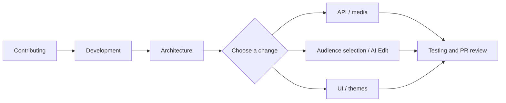

# Documentation

**New to ClipForge?** Start with the [installation and first-clip guide](../README.md#getting-started).
**Making a contribution?** Start with [CONTRIBUTING.md](../CONTRIBUTING.md).

## Find the right guide

| I want to… | Read |
| --- | --- |
| Install the app and make a clip | [README](../README.md) |
| Run a development environment and find the right code | [Development](development.md) |
| Understand services, storage, job claims, and rendering | [Architecture](architecture.md) |
| Integrate with the local backend | [API reference](api.md) |
| Understand how audience-first highlights are selected | [Audience selection](audience-selection.md) |
| Change project chat or the reviewed automation runner | [AI Edit integration](ai-edit-mode.md) |
| Run focused tests, inspect traces, or regenerate screenshots | [Testing](testing.md) |
| Review themes, mobile layouts, and accessibility | [UI review](ui-review.md) |
| Resolve setup, model, or media problems | [Troubleshooting](troubleshooting.md) |
| Discuss future features | [Roadmap](roadmap.md) |
| Check dependency attribution | [Credits](credits.md) |
| Maintain the public repository or prepare a release | [Publishing](publishing.md) |

## Contributor reading path

The implementation and regression tests are the source of truth. Update the
relevant guide when changing a payload, default, limit, or workflow.

[MIT license](../LICENSE) · [Code of Conduct](../CODE_OF_CONDUCT.md) ·
[Security reporting](../SECURITY.md)
