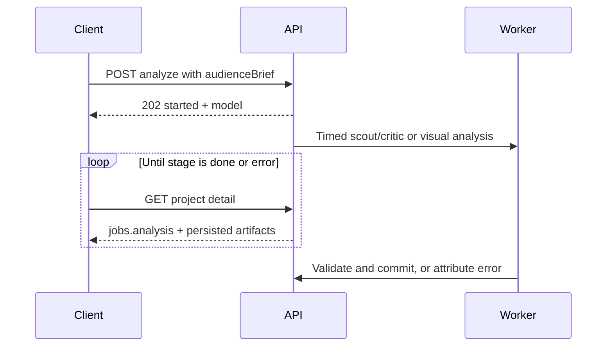

# Local API reference

[Documentation hub](README.md) · [Architecture](architecture.md) · [AI Edit](ai-edit-mode.md)

Base URL: **`http://127.0.0.1:5174/api`**. JSON requests use
`Content-Type: application/json`; IDs in examples are placeholders from earlier
responses. This is the local application API, not a multi-user hosted service.
Allowed browser origins are the app itself and local Vite port 5173; CLI requests
without an `Origin` header can access the local server.

Common failures return `{"error":"message"}`. Typical statuses: `400` invalid
input, `404` missing object/file, `409` conflicting job or unavailable export,
`422` unsupported visual capability, `429` bounded capacity, `502` provider/preview
failure. Successful async acceptance (`202`) is not job completion.

## Projects and sources

| Method | Path | Payload / result |
| --- | --- | --- |
| GET | `/projects` | Project list, most recently updated first |
| POST | `/projects` | `{sourcePath,name?,transcriptionMode?,captionStyle?,captionSettings?,videoFilters?,outputSettings?}` → `{id}`, `201` |
| POST | `/projects/upload` | Multipart `file`, optional `name`, `transcriptionMode`, `captionStyle` → `{id}`, `201` |
| GET | `/projects/<id>` | `{project,transcript,candidates,clips,jobs}` snapshot |
| PATCH | `/projects/<id>` | `{name}` → `204` |
| DELETE | `/projects/<id>` | Deletes owned records/managed media → `204`; active work conflicts |
| POST | `/projects/<id>/probe` | Probe and persist source metadata |
| POST | `/projects/<id>/extract-audio` | Extract audio with the shared transcription claim |
| GET | `/projects/<id>/file` | Source media with range-request support |

External `sourcePath` import references an existing local file; upload makes a
managed copy. Project-managed source paths cannot be reused as external imports;
upload another independent copy. Deleting a project does not delete external
originals. Common supported extensions include MP4/MOV/MKV/AVI/WebM and
MP3/WAV/M4A/FLAC/OGG/AAC.

```bash
curl -X POST http://127.0.0.1:5174/api/projects/upload \
  -F "file=@demo.mp4" -F "name=Demo story"
```

Project detail contains normalized `captionSettings`, `videoFilters`, and
`outputSettings`. Database-oriented fields such as `transcript.raw_json` and
`clip.render_settings_json` remain JSON **strings**, while `candidate.selection`
and `project.visualAnalysis` are parsed objects. See [audience metadata](audience-selection.md#persisted-explanations).

## Transcription and analysis

| Method | Path | Payload / result |
| --- | --- | --- |
| POST | `/projects/<id>/transcribe` | `{mode?,profileId?}` → `{status:"started"}`, `202` |
| GET | `/projects/<id>/transcribe/status` | Stage status/error |
| POST | `/projects/<id>/analyze` | `{mode?,brief?,audienceBrief?,provider?,profileId?}` → `{status:"started",model}`, `202` |
| GET | `/projects/<id>/analyze/status` | Stage status/error |

Transcription mode is `cloud` or `whisper` (`local` aliases `whisper`), selected
from the profile/default when omitted. An explicit mode must match an explicit
or active transcription profile. Analysis mode is `transcript` (default) or
`visual`; **`auto` is a frontend decision, not an accepted backend mode**.

When `profileId` is supplied it selects that LLM profile. Otherwise, omitting
`provider` uses the active profile/default. Supplying `provider` explicitly uses
that provider's environment/default connection unless `profileId` is also supplied;
the two must match. Speech needs a usable timed transcript; visual needs video
and a capable model.

```json
{
  "mode": "transcript",
  "brief": "Prefer a practical, complete example.",
  "audienceBrief": {
    "audience": "First-time founders",
    "goal": "Explain the customer problem",
    "notes": "Skip greetings and sponsor reads."
  }
}
```

`brief` has a 5,000-character limit. `audienceBrief` accepts only audience/goal/notes,
limited to 1,000/1,000/2,000 characters. Unknown analysis fields are rejected.
AI-generated candidates are validated before atomic replacement; failures and
no-approved-clip results preserve prior candidates and exports.

### Poll jobs by stage



Project `jobs.transcription` and `jobs.analysis` independently report
`idle`, `processing`, `done`, or `error`, with `error` text or `null`.
Old output can coexist with a failed rerun: stage errors take precedence over
the mere presence of candidates/transcript. Restarts turn interrupted work into
retryable errors. Stopping browser automation does not cancel an accepted job.

## Candidates and selection

| Method | Path | Payload / result |
| --- | --- | --- |
| POST | `/projects/<id>/candidates/manual` | `{startSec,endSec,title?}` → selected candidate, `201` |
| PATCH | `/projects/<id>/candidates` | `{selectedIds:[candidateId,...]}` → `{ok:true}` |

Manual cut times must be finite JSON numbers, not strings or booleans, satisfying
`0 <= startSec < endSec <= source_duration`. Manual cuts are not subject to the
AI 15–60s range. `title` is at most 200 trimmed characters. No transcript/model is
required. Selection IDs must belong to the project; validation happens before
the existing selection is reset.

```json
{"startSec":40,"endSec":65,"title":"A practical customer example"}
```

Candidate detail fields include `id`, `project_id`, `start_sec`, `end_sec`,
`score`, `hook`, `rationale`, `rank`, `selected` (0/1), and `selection`.
Manual/legacy records have `selection:null` in project detail. Manual creation's
immediate response retains its basic candidate shape without that optional field.

## Settings, frame previews, and suggestions

| Method | Path | Payload / result |
| --- | --- | --- |
| GET | `/render-settings` | Versioned authoritative contract, currently **3** |
| GET / PUT | `/projects/<id>/render-settings` | `{captionSettings,videoFilters,outputSettings}` |
| POST | `/projects/<id>/preview-frame` | Render settings plus `time` → `image/jpeg` |
| GET | `/projects/<id>/filter-suggestions` | Saved look suggestions |
| POST | `/projects/<id>/filter-suggestions/generate` | `{brief?,audienceBrief?}` → saved transcript-based suggestion, `201` |
| POST | `/projects/<id>/filter-suggestions` | Save supplied suggestion metadata for review, `201` |

Read the contract instead of duplicating ranges/presets. A minimal output save:

```json
{
  "outputSettings": {"mode":"manual","aspectRatio":"9:16","fit":"contain","maxDimension":1920},
  "videoFilters": {"brightness":0,"contrast":1,"saturation":1,"blur":0,"sharpen":0}
}
```

Output modes: `source`, `manual`, `ai`. Ratios: `source`, `16:9`, `9:16`, `1:1`,
`4:5`, `4:3`, `3:2`. Fits: `contain`, `crop`. New defaults preserve source;
legacy defaults preserve portrait center-crop. Preview `time` must be finite,
nonnegative, and before source duration. Preview and render use identical geometry.

Generated look suggestions need a transcript, use the active LLM, and have a
separate **2,000-character** `brief` limit. They do not inspect frames, generate
clip boundaries, or apply settings automatically. Supplied suggestion metadata
accepts `settings`/`videoFilters`, optional `captionSettings`, `outputSettings`,
`source:"ai"`, `model`, and `rationale`; it is labeled user-provided evidence.

## Rendering and export

| Method | Path | Payload / result |
| --- | --- | --- |
| POST | `/projects/<id>/render/<candidateId>` | Reviewed settings → `{clipId,status}` |
| POST | `/projects/<id>/render-batch` | Reviewed settings; selected candidates → `{clipIds,count,status}` |
| GET | `/clips/<clipId>/status` | `{status,log,error}` |
| GET | `/clips/<clipId>/file` | Completed MP4 with branded filename |
| GET | `/projects/<id>/export` | ZIP of available completed selected artifacts |
| GET | `/projects/<id>/export?clipIds=<id1>,<id2>` | ZIP of the exact requested completed artifacts |

Render requests accept `captionStyle`, `captionSettings`, `videoFilters`, and
`outputSettings`; omitted values resolve from the project's saved settings.
New/active work returns `202` with `status:"started"`; matching completed reuse
returns `200` with `status:"done"`. Clip statuses are `pending`, `rendering`,
`done`, or `error`. Track the **returned clip ID**, including reused artifacts.

Identity includes geometry, look, and effective caption content. A settings change
does not alter completed MP4s; it permits a new render. Download/export GETs never
queue rendering.

Explicit ZIP selection accepts 1–500 IDs, all owned and completed/available;
unavailable requested artifacts fail rather than silently substituting another.
Without IDs, the latest completed artifact for each selected candidate is used,
and unavailable selections may be skipped. Response headers report
`X-Export-Clip-Count` and `X-Export-Skipped-Count`.

Filenames: `clipforge-clip-<rank>-<artifact-id>.mp4` and
`clipforge-<sanitized-project-name>-clips.zip`.

## AI Edit advice

| Method | Path | Payload / result |
| --- | --- | --- |
| POST | `/projects/<id>/ai-edit/chat` | `{message,messages?,brief?,audienceBrief?}` → `{message,model,basis}` |
| POST | `/projects/<id>/ai-edit/recommendations` | `{brief?,audienceBrief?}` → visual recommendation |

Chat messages are at most 2,000 characters; history is at most 20 exact
`{role,text}` entries with `role: user | guide | model`, each at most 2,000
characters. Context includes allowlisted technical metadata and up to 12,000
characters of optional transcript, not source paths or other projects.

Advice routes use the active analysis connection. Recommendations include
framing, partial caption/filter suggestions, audience, candidates/evidence,
sample timestamps, source metadata, context notice, and actual model. Neither
advice endpoint persists candidates or starts renders. The frontend has a
separate reviewed orchestration flow; [AI Edit integration](ai-edit-mode.md).

## Providers and settings

| Method | Path | Payload / result |
| --- | --- | --- |
| GET | `/status` | Tool availability and configured-key booleans; no secret values |
| GET / PUT | `/settings` | Masked app defaults / allowlisted environment-setting writes |
| GET | `/provider-profiles` | `{profiles,active,fallback}` |
| POST | `/provider-profiles` | `{name,kind,provider,apiKey?,baseUrl?,model?}` → profile, `201` |
| PUT / DELETE | `/provider-profiles/<profileId>` | Edit profile / remove it (`204`) |
| PUT | `/provider-profiles/active` | `{kind,profileId}`; `null` clears active selection |
| POST | `/test-connection` | `{provider?,profileId?}` → `{ok,message,latencyMs}` |

Profile kinds are `llm` and `transcription`. Public fields include
`effectiveModel`, `effectiveBaseUrl`, and `hasApiKey`; **never `apiKey`**.
Blank/omitted update keys retain the existing secret. Custom LLM connections
require base URL/model. Deepgram is fixed to nova-2/listen; Whisper uses a
supported local model. [Connection details](development.md#provider-connections).

Settings writes use uppercase allowlisted names from `.env.example` plus
supported model defaults (`WHISPER_MODEL`, `OLLAMA_MODEL`); reads use the UI's
camelCase representation. `DATA_DIR` is a launch-time setting, not a settings-API
write. Saved defaults persist to `DATA_DIR/.env`.

## YouTube and local model setup

| Method | Path | Payload / result |
| --- | --- | --- |
| POST | `/youtube/check` | `{url}` → metadata/license information |
| POST | `/youtube/download` | `{url}` → `{jobId,status:"started"}`, `202` |
| GET | `/youtube/download/<jobId>` | `{status,path,error,progress,log}` |
| POST | `/ollama/pull` | `{model?}` → waits for local Ollama pull result |

A completed YouTube download supplies a path for project creation; it does not
create the project itself. Download jobs are in-memory and do not survive restart.
Ollama must already be running on its default local port. License metadata is
informational.

## Where to verify a contract

Routes live in `backend/routes/`; client types/functions in
`frontend/src/api/client.ts` and `aiEdit.ts`. Contract tests are listed in
[Testing](testing.md#focused-checks). When adding a field, update route validation,
serialization, the client, meaningful tests, and this reference together.
