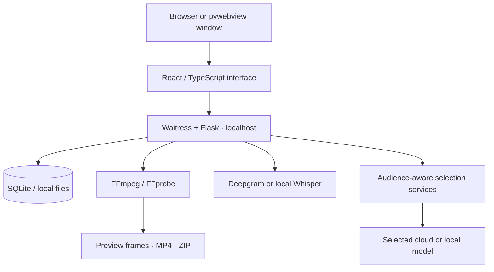
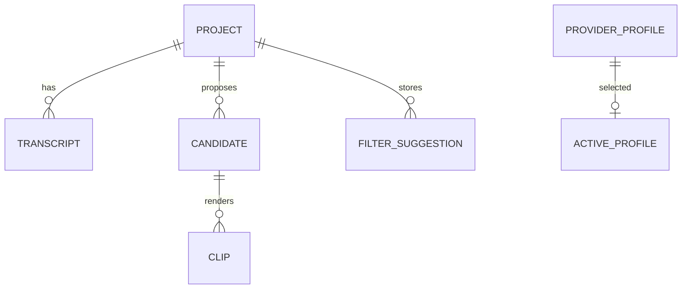

# Architecture

ClipForge is a local-first desktop/browser application with a single Python
backend. The browser and pywebview window use the same React interface and REST
API.

## Components

[Documentation hub](README.md) · [Development](development.md) · [API reference](api.md)

| Location | Responsibility |
| --- | --- |
| `main.py` | Browser/desktop startup and local server |
| `backend/app.py` | Flask factory, routes, local-origin checks, frontend serving |
| `backend/database.py` | SQLite schema, additive migrations, connections |
| `backend/routes/` | HTTP validation, job dispatch, persistence, file responses |
| `backend/services/` | Provider calls, media/captions, geometry, job claims |
| `frontend/src/api/` | Typed API requests and automation orchestration |
| `frontend/src/components/` | Project, editor, settings, and AI Edit interface |
| `tests/` | Backend contracts and synthetic-media integration coverage |
| `frontend/tests/` | Playwright workflows against the built interface |

The backend uses Python's `sqlite3`, not an ORM. FFmpeg/FFprobe run as subprocesses.
The frontend build is served by Flask; Vite proxies `/api` during development.

## Project lifecycle

1. Import/upload media and probe its duration, streams, and display geometry.
2. Optionally extract/transcribe speech with Deepgram or local Whisper.
3. Use timed speech scout/critic selection or sampled-frame recommendations with
   an audience brief and selected model, or create manual clip candidates.
4. Review candidates, persist selection, and choose output/caption/filter settings.
5. Render through FFmpeg, track the returned artifact ID, and serve previews or
   completed-file downloads.

Transcript analysis requires usable speech. Visual analysis requires a video
stream and image-capable model, but no transcript. Audio-only renders use a black
canvas. Captions require suitable transcript content.

## Persistence and jobs

`DATA_DIR` defaults to `~/.clipforge` and contains the SQLite database, saved
settings/profiles, and managed media. Root `.env` values are initial defaults;
saved `DATA_DIR/.env` values take precedence at startup. Profile credentials are
write-only through the API and stored locally, not encrypted at rest.

Transcription and analysis use independently attributed jobs and serialized
availability checks. Explicit audio extraction additionally uses persisted claim
tokens to prevent stale workers publishing over a newer attempt. Candidate
replacement is atomic after validation. Rendering uses a shared two-worker
executor and deduplicates matching active/completed work.

Interrupted jobs become retryable errors after restart rather than resuming
checkpoints. YouTube download status is in memory. Stopping AI Edit halts future
browser orchestration; an accepted backend job may still complete.

### Data relationships

Transcript rows store normalized source timing in `raw_json`. Candidates store
boundaries, selection, and optional `selection_json` explanations. Clip rows
record the artifact path/status and immutable render identity. Provider profiles
and active selections are independent of project data. Legacy copy-metadata
tables do not imply social-platform publishing is implemented.

Audience drafts use `clipforge.audience.v1.<projectId>` in `localStorage` and are
shared by Manual/AI controls. AI options/chat use project-scoped `sessionStorage`;
neither storage resumes an interrupted plan automatically. Project detail
serializes validated candidate metadata as `selection`, with `null` for legacy
and manual cuts.

## Shared rendering contract

`GET /api/render-settings` exposes the authoritative caption/filter/output
contract. Contract version 3 includes source-preserving output defaults for new
projects and legacy portrait defaults for existing projects.

Output settings are passed unchanged through save, exact frame preview, and
render requests. Effective geometry accounts for rotation/sample aspect ratio
and even H.264 dimensions. Fit preserves the full frame; center-crop trims edges;
neither stretches it.

Render identity includes output geometry, filters, captions, and the relevant
transcript content. Changing the look enables a new render; completed artifacts
retain their recorded appearance. UI downloads follow exact returned clip IDs,
not an assumed latest candidate output.

## AI boundaries

Provider profiles select the model, endpoint, and credentials. Model results are
schema-validated before persistence. Invalid timing, scores, or frame evidence
must not become clip records.

Speech analysis receives the full timed transcript, not just a flattened string.
Bounded overlapping windows feed a scout, then shortlisted clip text feeds a
second critic call on the same frozen connection. Code owns boundary resolution,
quote validation, score arithmetic, quality gates, and overlap/topic-label
deduplication. No-approved-result and invalid-output failures preserve prior
candidates/artifacts. See [Audience selection](audience-selection.md) for budgets,
metadata, and evaluation.

Visual analysis normally sends ten timestamped bounded JPEG samples through
OpenAI-compatible multimodal requests or native Claude image blocks. It does
not send audio or provide full-video/beat understanding.

Project chat uses allowlisted technical metadata and optional speech context.
Chat and visual recommendations do not mutate candidates or editor settings.
Analysis jobs persist candidates; AI Edit applies recommendations only through
the user's reviewed workflow choice.

See [AI Edit integration](ai-edit-mode.md) and the [API reference](api.md) for
detailed contracts. Preview/advice capacity is bounded with semaphores, while
transcription/analysis run outside request threads. Network calls do not hold a
long-lived SQLite write transaction.
