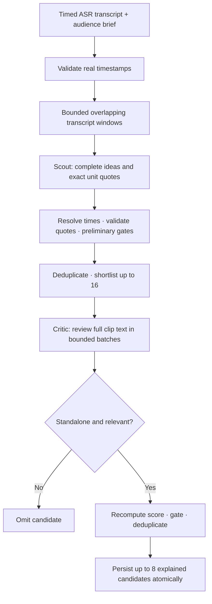
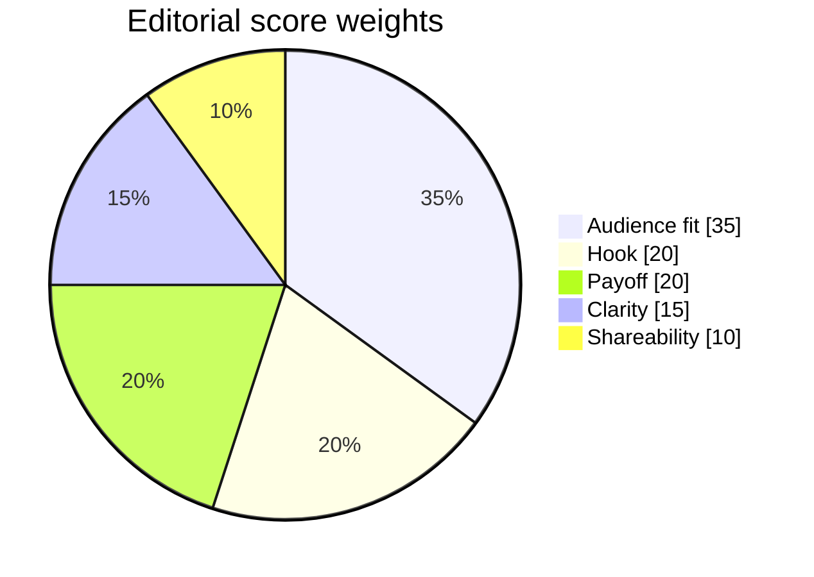

# Audience-first clip selection

[Documentation hub](README.md) · [API reference](api.md) · [AI Edit](ai-edit-mode.md)

**Method identifier: `audience-first-v1`.** Its purpose is to find complete,
source-supported ideas for a specific viewer. A dramatic moment is not useful
merely because it is dramatic.

## The brief

```json
{
  "audience": "First-time founders",
  "goal": "Explain a product through the customer problem",
  "notes": "Keep the practical example. Skip greetings and sponsor reads."
}
```

Audience and goal allow 1,000 characters each; notes allow 2,000. Only these fields
are accepted in `audienceBrief`. Empty values are allowed. When audience is absent,
the model is asked to infer a narrow audience from the source; metadata labels
that assumption with `audienceInferred: true`.

Manual and AI Edit share project-scoped audience fields. Changing them saves a
draft but makes no model request. Analysis, recommendations, chat, and
transcript-based look suggestions receive the structured brief when their
buttons are used. Existing candidates keep their original explanation until a
new analysis replaces them; changing a draft is not reranking.

## Speech: evidence scout, then editorial critic



1. **Validate evidence.** Prefer complete word timestamps, grouped at punctuation,
   speaker changes, pauses, or roughly eight-second spans. If a legacy word array
   is partial, use valid timed segments. Missing/invalid timing requires another
   transcription; the code does not interpolate guessed timestamps.
2. **Cover the source.** Scout windows cover the entire transcript within the
   resource budget, with bounded overlap near window edges. An oversized source
   is rejected rather than silently analyzing only its opening.
3. **Scout ideas.** The model proposes supplied `startUnit`/`endUnit` IDs, quotes
   from their text, a truthful hook, topic, audience benefit, and five assessments.
   Source-unit times determine clip boundaries; a model score field is ignored.
4. **Shortlist.** Local code applies the preliminary gate, removes overlapping
   intervals and duplicate normalized topic labels, and keeps up to 16 finalists.
5. **Critic review.** A separate call receives each shortlisted clip's full bounded
   text and evidence, audience, and goal — not scout scores. It can reject or
   reassess supplied candidates, but cannot introduce new times or candidates.
6. **Final ranking.** Code recomputes scores, applies the gate, removes overlaps
   and repeated topic labels, and keeps at most eight. Rejected ideas are not
   replaced with random filler.

Scout and critic use the **same frozen configured connection**. These are two
editorial roles in separate requests, not independent models, external agents,
or a guarantee against shared judgment errors. Duplicate-label matching is exact
after whitespace/case normalization, not a semantic duplicate classifier.

## Rubric and gates

| Dimension | Weight | Editorial meaning |
| --- | ---: | --- |
| Audience fit | 35% | Relevance to the specified viewer and knowledge level |
| Hook | 20% | The actual opening earns relevant attention |
| Payoff | 20% | A useful, entertaining, or emotional resolution |
| Clarity | 15% | Understandable without missing setup or references |
| Shareability | 10% | A concrete reason this viewer would save/share it |



Scale: **0 absent · 1 weak · 2 limited · 3 clear · 4 strong · 5 exceptional**.
All values must be finite numbers, not booleans or numeric strings.

```text
score = round(Σ(dimension × weight / 5), 1)
gate  = audienceFit >= 3 AND payoff >= 3 AND clarity >= 3
```

For `{audienceFit:5, hook:4, payoff:5, clarity:4, shareability:3}`, the score is
**89.0**. A clip with audience fit 2 fails even if its hook is exceptional. The
critic must also mark a candidate `selfContained: true`.

These are model editorial assessments. They are not measured retention, viewer
satisfaction, predicted view counts, trend data, or guaranteed virality.

## Source constraints and budgets

| Constraint | Current value / behavior |
| --- | --- |
| Speech clip length | 15–60 seconds; full source when shorter than 15 seconds |
| Transcript window | 12,000 serialized unit characters; maximum 16 windows |
| Window overlap | Up to roughly 60 seconds, capped to keep forward progress |
| Scout results | Up to 8 per window |
| Critic shortlist | Up to 16, split into 16,000-character candidate-context batches |
| Final results | Up to 8 source-bound, non-overlapping candidates |
| Model response | JSON object, at most 32,000 characters; duplicate keys/nonfinite JSON rejected |
| Speech request | One attempt; 5-second connect / 60-second read timeout; 4,500 output tokens |
| Analysis budget | 20 minutes, checked before each provider request; not a forced cancellation of an in-flight call |

Character budgets concern the serialized evidence/context portion, not token
counts or all prompt overhead. Smaller-context models may need shorter sources.
Opening/closing quote checks preserve punctuation/symbols: `C++`, `C#`, and `10%`
are not interchangeable. Quote presence and valid boundaries do not alone prove
semantic completeness; review the resulting audio/video.

## Visual selection is different

Visual analysis samples **8–12 stills**, normally ten, at actual source times.
JPEGs are bounded to 768px maximum edge, 256KiB each, and 2MiB total. No audio is
sent and continuous action between samples is not observed.

The visual model uses the same audience policy and rubric in **one recommendation
pass**, not the speech scout/critic flow. It returns an `evidenceFrame` index and
visible description. Code verifies a real sampled time inside the proposed
interval, computes the score locally, and applies gates/deduplication. Sparse
frame evidence supports only approximate timing; inspect the full clip for setup
and payoff. Music or visual energy does not establish a spoken takeaway.

Caption suggestions are disabled without usable speech context. Models with
known text-only capability fail clearly rather than pretending to inspect images.
The internal service has an explicit metadata-only fallback; normal UI visual
requests require an image-capable model.

## Persisted explanations

`GET /api/projects/<id>` exposes `candidate.selection`:

```json
{
  "method": "audience-first-v1",
  "audience": "First-time founders",
  "audienceInferred": false,
  "assessment": {"audienceFit": 5, "hook": 4, "payoff": 5, "clarity": 4, "shareability": 3},
  "audienceReason": "A complete example helps explain why a customer would care.",
  "topic": "Customer-first pitch",
  "evidence": {
    "basis": "transcript",
    "openingQuote": "Lead with the customer problem.",
    "closingQuote": "Show one example of the result they can achieve."
  }
}
```

Frame evidence uses `{basis:"sampled-frames", timeSeconds, description}` instead.
Legacy/manual candidates expose `selection: null`; a manual score of zero is not
an editorial judgment. Raw `selection_json` is not returned in candidate objects.

Replacement is atomic after validation. Invalid output or no approved candidates
sets the analysis error and preserves existing candidates/artifacts. AI Edit
requires its separate replacement acknowledgment before reanalysis.

## Evaluate quality

Use representative sources and a concrete intended viewer, not only a single
dramatic test clip. A practical evaluation set includes:

| Source case | Expected behavior |
| --- | --- |
| Tutorial with intro/sponsor material | Prefer a complete demonstration and outcome |
| Interview with exciting but off-topic anecdotes | Reject anecdotes irrelevant to the requested audience |
| Long lecture with relevant ideas late in the source | Cover later windows, not only the opening |
| Setup without an available payoff | Return fewer clips or none |
| Partial word arrays / punctuation-heavy technical terms | Preserve timing/evidence correctness |
| Silent footage / music video | Use visible sampled evidence; invent no speech/audio understanding |

For each model/profile change, record source kind, audience/goal, expected ideas,
actual boundaries, quotes, rubric, and rejected filler. Watch each candidate:
does its opening establish enough context, does its ending deliver, and would
this audience understand and benefit? Compare against a human shortlist and
track false positives/omissions. Automated fixtures verify contracts, not the
truth of an editorial assessment. [Testing guide](testing.md).

## Implementation and references

- `backend/services/clip_selection_service.py`: policy, timing, windows, gates,
  score arithmetic, source validation, scout/critic orchestration.
- `llm_service.py` and `visual_analysis_service.py`: provider-specific transport.
- `routes/analysis.py`: asynchronous persistence and rollback.
- `tests/test_audience_clip_selection.py`: timed evidence, relevance gates,
  budgets, transport parity, privacy, rollback fixtures.

The policy uses public principles about audience relevance and viewer
satisfaction, not inside knowledge of a platform ranking algorithm:
[YouTube discovery tips](https://support.google.com/youtube/answer/141805),
[audience retention](https://support.google.com/youtube/answer/9314415), and
[Anthropic's grounded-output guidance](https://platform.claude.com/docs/en/test-and-evaluate/strengthen-guardrails/reduce-hallucinations).
